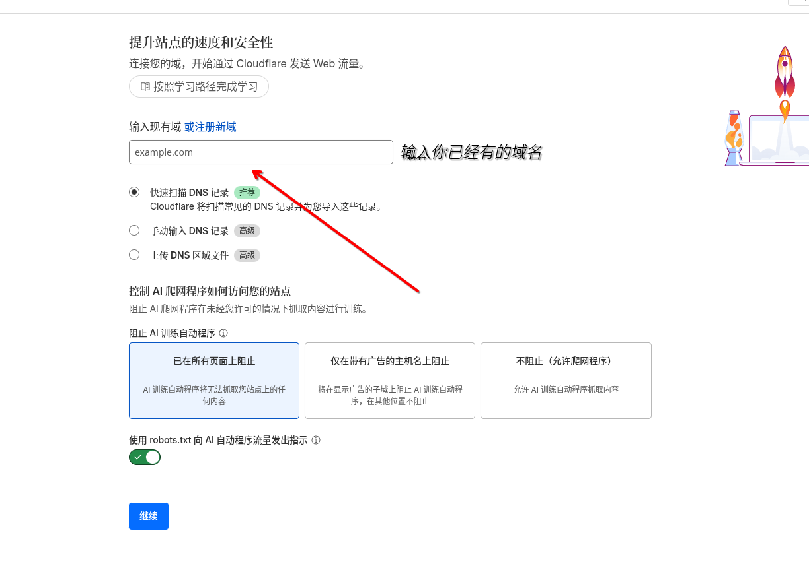
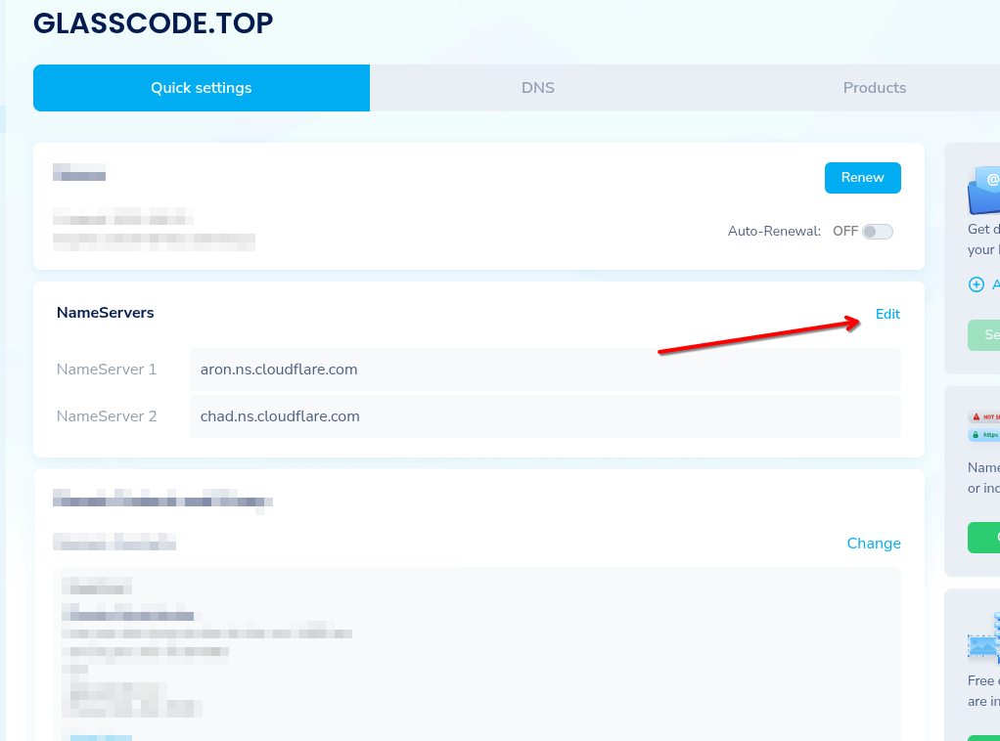
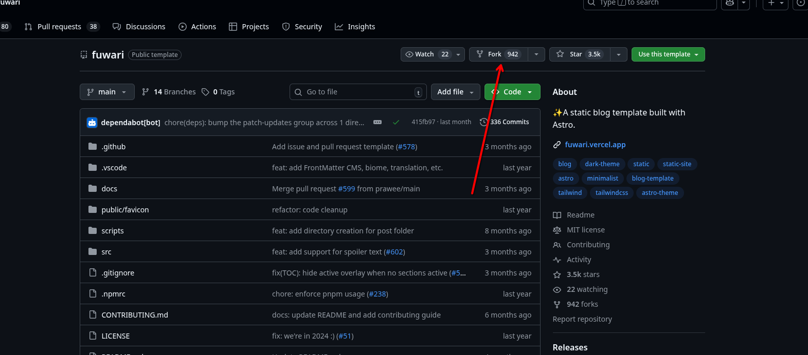

> **小贴士**
>
> 本文章稍微有点简略，可以理解为备忘

## 将域名托管到赛博活佛

### A.1登陆与注册Cloudflare账户

先确保你能打开Cloudflare仪表板，打不开可以用奇怪魔法。

注册完记得验证。

### A.2托管域名！




然后要求修改ns服务器地址，我用namesilo



修改即可

一阶段完成

## fork项目，克隆与提交更改

### A.1 fork项目

登陆github，打开fuwari的仓库，如图。



(写稿时github抽风了，所以说接下来github相关的无图)

### A.2克隆项目

fork后复制URL直接git clone（该不会真要写git安装教程吧）

```bash
cd fuwari
```

我这边用archlinux

```bash
sudo pacman -S nodejs pnpm
pnpm install
```

### A.3修改，提交更改

修改根目录的`config.ts`

- title：你的博客主标题
- subtitle：你的博客副标题。可选，在首页会显示为“主标题 - 副标题”
- lang：博客显示语言。注释已经列出了一些常用的值
- themeColor：hue值则是你的博客主题色

修改后可以先`pnpm dev`看看正不正常

第一次使用git需配置

`git config --global user.name "你的github账户名称"`
`git config --global user.email "你的github账户邮箱"`
`ssh-keygen -t rsa`（全部默认，然后到账户根目录的.ssh中找pub,文本编辑器打开，复制里面内容到github创建ssh密钥即可）
`git remote set-url origin git@github.com:xxx/xxx`（xxx内容记得修改！）

然后我们就可以提交更改了

```bash
git add .
git commit -m "xxx"
git push
```

这时打开github仓库应该就会显示更改

## 与赛博活佛建立连接

在#Workers 和 Pages中创建应用程序，选择pages-导入现有的git存储库。

登陆github账户，选择好仓库，下一步也保持默认即可。

自定义域中修改域名，稍等片刻，就可以访问了。

## 后记

md文档用黑曜石写即可，非常好用

默认的文档记得删除

以后写完文章只需要提交修改，cf即可自动完成善后工作。